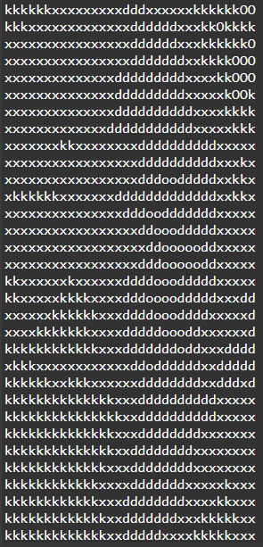
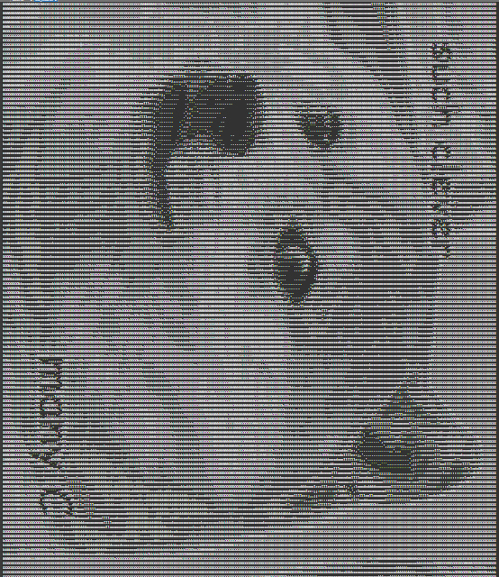

# Image Restoration from Fragments

## Overview

This program reconstructs a complete image from a set of separate fragments by checking and matching the edges of each piece. The algorithm searches for the correct order of fragments so that all adjacent sides fit seamlessly, ultimately restoring the original image. The solution is implemented in C using recursion and dynamic memory allocation.

## Example

Given these image fragments:

The program restores the original picture:

## Demo

You can run and test the code online without installing anything:
**[Try it on OnlineGDB](https://onlinegdb.com/md1NL4gYP)**
